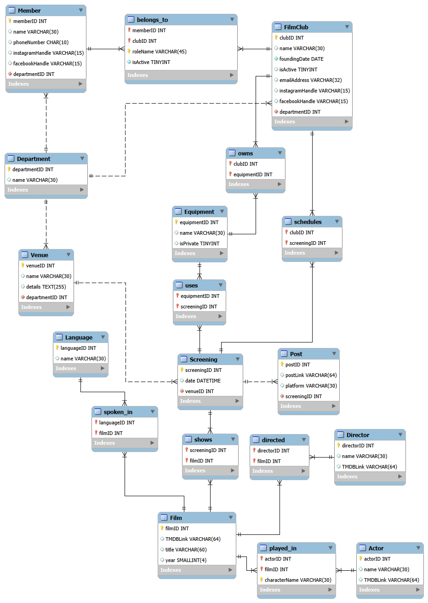

# FilmClubsAUThDB 🎬



## Overview
**FilmClubsAUThDB** is a comprehensive relational database system designed to organize, manage, and archive the operations, screenings, and resources of the student film clubs at the Aristotle University of Thessaloniki (AUTh). 

Over the years, numerous film clubs have been established at AUTh, hosting hundreds of movie screenings. This database transitions their tracking system from cumbersome spreadsheets into a robust, scalable MySQL database, ensuring data integrity, easy querying, and efficient resource sharing between clubs.

## Features & Capabilities
The database is designed to handle complex relationships between university departments, film clubs, students, and cinematic data. Key features include:
* **Club & Member Management:** Tracks film clubs, their founding dates, active status, and associated university departments. It also manages student members and their specific roles within clubs (e.g., casual member, treasurer, IT).
* **Equipment Tracking (Shared & Private):** Allows clubs to register equipment (projectors, speakers, etc.) and specify whether it is private or available for public use by other clubs.
* **Screening Organization:** Schedules screenings at specific university venues, linking them to the hosting club(s) and the specific equipment used.
* **Cinematic Archive:** Catalogs films with detailed metadata, including release years, spoken languages, directors, cast members (and their specific character roles), and TMDB links.
* **Social Media Integration:** Tracks promotional posts across various platforms (Facebook, Instagram) linked to specific screenings.

## User Roles
The database architecture supports various user access levels with specific privileges:
1. **Visitor (Public):** Can view scheduled screenings, film details, and venue locations.
2. **Simple Member:** Has visitor privileges plus access to internal contact details for club coordination.
3. **Content Manager:** Responsible for inserting new cinematic data (Films, Directors, Actors) and creating new Screening events.
4. **Equipment Manager:** Manages the registry of private and shared equipment and its allocation for specific screenings.
5. **Club Admin:** Manages member statuses, assigns roles, updates club profiles, and handles equipment co-ownership.
6. **DB Administrator:** Full system access for maintenance, entity creation (Departments, Venues), and data integrity.

## Technical Details

### Architecture & Normalization
The database follows the **Relational Model** and is normalized to the **Third Normal Form (3NF)** to eliminate data redundancy and prevent update anomalies. 

### Core Schema & Entities
The database consists of strong entities and associative tables to resolve Many-to-Many (N:M) relationships:
* **Core Entities:** `Member`, `FilmClub`, `Department`, `Venue`, `Equipment`, `Screening`, `Post`, `Film`, `Language`, `Director`, `Actor`.
* **Associative Entities (N:M Resolutions):**
  * `belongs_to`: Links Members to FilmClubs, tracking `roleName` and `isActive` status.
  * `owns`: Links FilmClubs to the Equipment they co-own.
  * `uses`: Tracks which Equipment is utilized in which Screening.
  * `schedules`: Links Screenings to the organizing FilmClub(s) (supporting co-hosted events).
  * `shows`: Links Screenings to Films (supporting double-features or marathons).
  * `played_in`: Links Actors to Films, storing the specific `characterName`.
  * `directed`: Links Directors to Films.
  * `spoken_in`: Links Languages to Films.

### Implemented Views
To simplify complex, frequently used queries, the following SQL Views are implemented:
1. **`FULL_SCHEDULE`**: Provides a complete overview of upcoming and past events (Date, Movie Title, Venue Name, Organizing Club).
2. **`CAST_LIST`**: Generates a full credits list per movie (Movie Title, Actor Name, Character Name).
3. **`ACTIVE_CLUB_MEMBERS`**: Generates a roster of currently active members per club, including their roles and contact info.

## Repository Structure
* `/docs`: Contains the project reports and relational algebra design (Deliverable 1).
* `FilmClubsAUThDB.mwb`: The MySQL Workbench model file.
* `FilmClubsAUThDB.png`: Exported Entity-Relationship (ER) Diagram.
* `dbdump.sql`: The complete SQL dump file containing the database schema (DDL), views, and sample populated data (DML).
* `users.sql`: SQL script for creating database users and assigning their respective privileges.
* `/queries`: A collection of SQL scripts (`query1.sql`, `query2.sql`, etc.) demonstrating complex selections, joins, and aggregations (e.g., finding co-hosted screenings, calculating movie age, finding films without listed directors).

## Setup & Installation
To run this database locally:
1. Ensure you have **MySQL** and **MySQL Workbench** installed.
2. Clone this repository.
3. Open MySQL Workbench and connect to your local server.
4. Open the `dbdump.sql` file. Ensure the script begins with the database creation commands:
   ```sql
   DROP SCHEMA IF EXISTS `FilmClubsAUThDB`;
   CREATE SCHEMA `FilmClubsAUThDB`;
   USE `FilmClubsAUThDB`;
   ```
* Execute the script. This will create all tables, establish the foreign key constraints, define the views, and populate the database with the sample data.
5. **Configure Users:** Open and execute the `users.sql` file to generate the necessary database users and assign their respective role-based access privileges.
6. **Run Queries:** You can test the database's functionality by opening and executing the individual query scripts (e.g., `query1.sql`, `query2.sql`) provided in the repository.

*(Optional)* You can also explore or modify the visual schema by opening the `FilmClubsAUThDB.mwb` model file in MySQL Workbench. From there, you can utilize the Forward/Reverse Engineer features found under the Database menu.

## Graphical User Interface
An application has been developed for this database with complete frontend and backend developed, which can be found in the `assignment-3` folder

## Academic Context
This project constitutes the deliverables for the **Databases** course (9th Semester, 2025) at the Department of Electrical and Computer Engineering (ECE), Aristotle University of Thessaloniki (AUTh).
